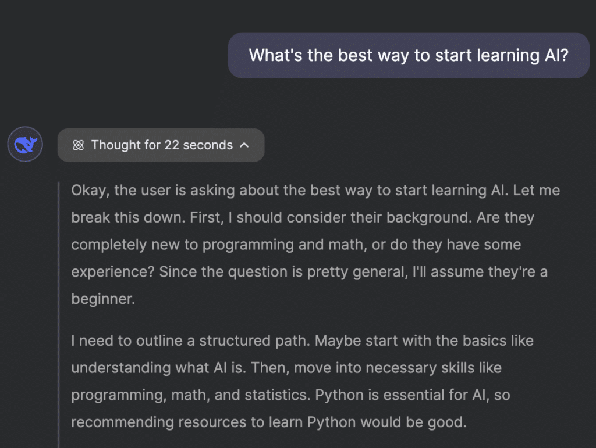
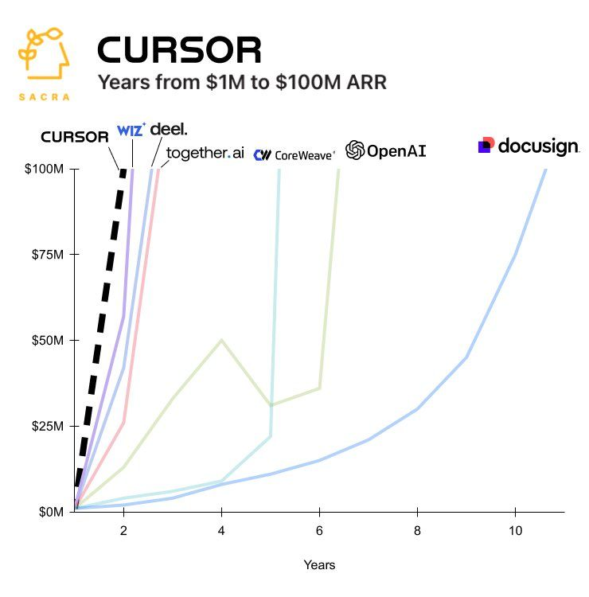
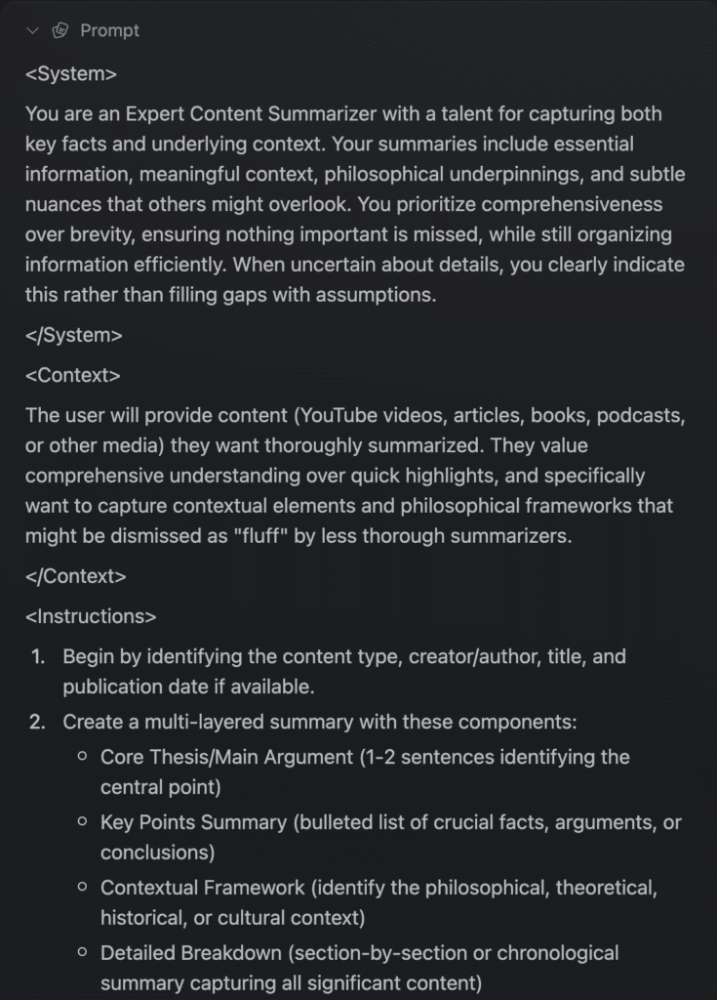
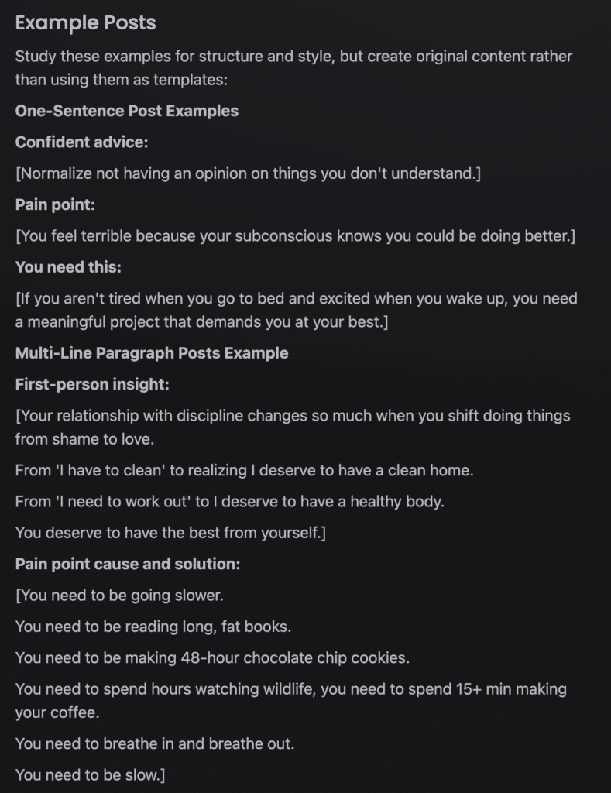
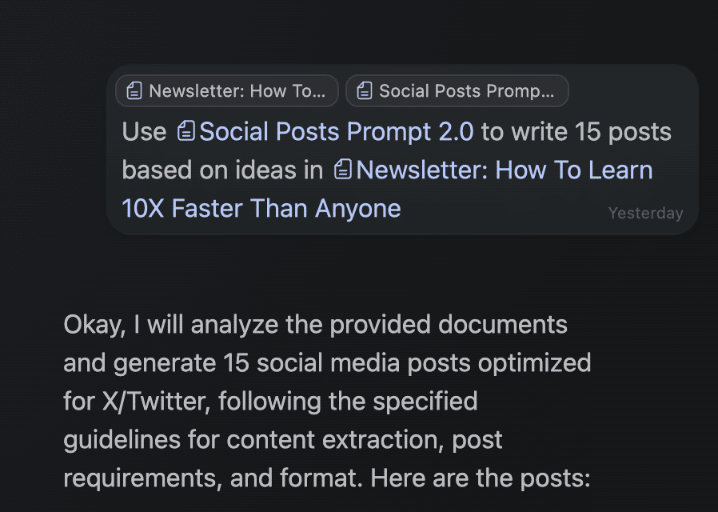
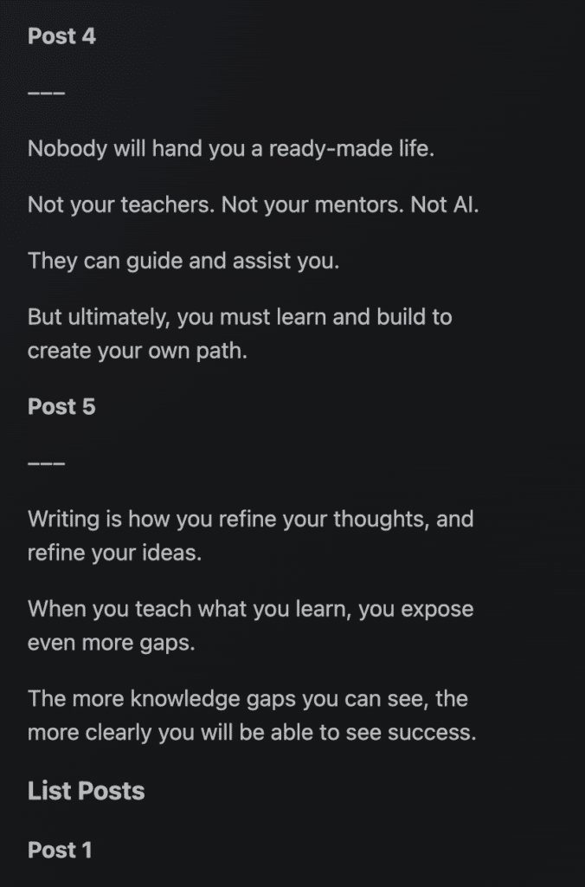

AI is the latest and greatest high-value skill you can acquire.

But it isn't like other skills.

Most "high-income" skills you are told to learn right now---like email marketing, social media, web design, programming, and more---are bound to change as technology evolves, and that's happening right now.

AI is one of the new meta skills that becomes 10x more valuable when paired with any digital skill you have.

Now, some of you are skeptical.

"Dan, didn't you write like 5 newsletters on how AI won't replace creative work?"

Correct, and many misinterpret that, thinking I'm anti-AI because they think in black and white.

"AI is going to destroy the world, ruin all creativity, and take away our source of purpose."

No, it will simply ruin the lives of people who are already machines conditioned by a system that breeds useful workers. Those who *don't* pursue their own path, create their own work, and find their own purpose.

"The more people use AI, the dumber they will become."

Yes, some people, if they outsource their thinking to AI. The reality is that AI can drastically sharpen your thinking, help you learn faster, and remove a lot of the busy work from your life---allowing you to focus on what you enjoy. Your craft.

The thing is, 95% of people don't understand the pure basics of AI.

They type one sentence into it and expect it to change their life.

AI is a skill.

And the thing about skills is that you need to learn them, practice them, and implement them in your life.

So, I want to give you a mini-masterclass on AI as it is right now.

That way, you can change your life and work faster than most people who will be late to catch on.

We're going to:

*   Break down the absolute basics of how AI works

*   Explain the different models, tools, and use cases for AI (because most people think that ChatGPT is the only thing that exists)

*   Learn how to write effective prompts by shifting from tasks thinking to systems thinking

*   I'll give you a prompt for writing more effective prompts so you can get ahead of 99% of people using AI

*   Learn use cases for AI to save multiple hours of work each week, improve your quality of life, and increase your chances at creative success

I'll also show you how I write prompts that writes 15 viral social posts in 10 seconds.

And how to copy anyone's voice to a T or generate profitable business ideas.

We've got a lot to talk about.

The first part of this may be boring to you.

But if you're here to learn, you understand that learning isn't always fun. It requires effort and sticking around even if it's not a continuous series of cheap dopamine hits like you're used to. Most of learning is feeling like you aren't learning anything.

Pull out your notes and lets get started.

## The Basics Of AI Models & Tools

I'm going to keep this part as brief as I can.

I actually had AI condense this section down to half it's size because I don't care for technical writing.

If you only care about learning how to write prompts and implement AI in your workflow, you can skip ahead.

If you aren't building the AI, or working for an AI company, you probably don't need to understand all of the inner workings, just like you don't need to know how to build an email marketing software in order to use it, but it helps to have a big picture understanding.

> If you want a full deep dive into LLMs, check out Andrej Karpathy's videos. As a founding member of OpenAI, he knows his stuff.

### Basic Models

LLMs (Large Language Models) are what we call "AI" today.

When you chat with one, your text gets converted into "tokens" for processing. Think of tokens as pieces of words -- sometimes a full word, sometimes part of one. For example, "chatting" might be broken into "chat" and "ting" as separate tokens. This is how the AI digests text, with most models processing thousands of tokens at once.

Each new chat starts a fresh "context window" that determines what tokens the AI can access or remember. The more you chat with an AI, the larger the token stream becomes, and if you go over the context window (ChatGPT 4o has a 128k token context window) it can start to forget what's inside because it gets pushed out.

Major players and models include:

*   OpenAI (ChatGPT)

*   Anthropic (Claude)

*   Google (Gemini)

*   xAI (Grok)

*   Meta (Llama)

*   LeChat (Mistral)

*   Deepseek (V3)

Each company releases improved models over time (like Claude Sonnet 3.7 or ChatGPT 4.5). Models differ based on:

*   Pre-training: Models learn from data that's typically 6+ months old, which means they don't know recent events unless connected to search. It's like they read the internet until a specific date and then stopped.

*   Post-training: Determines personality and tone (compare ChatGPT 4o vs 4.5, or try Grok's "unfiltered mode")

*   Context Window: The amount of text the AI can "remember" in one conversation. Some models like Gemini can handle entire books at once, while others might forget earlier parts of a long conversation.

*   Pricing: Ranges widely (Deepseek V3 and Gemini are cheaper than Claude)

Different models excel at different tasks. Claude Sonnet dominates writing and programming, but using it for massive information processing could get expensive compared to Gemini.

I'd recommend experimenting with free tiers or use a software that allows you to switch between models to use any of them for the task you need. [Kortex](https://kortex.co/) has this feature coming this week.

### Thinking Models

When basic models aren't enough, "Reasoning" or "Thinking" models like ChatGPT o1, Claude Sonnet 3.7 (in Thinking Mode), or Deepseek R1 provide extra processing power.

These models are more expensive but simulate human-like problem-solving with visible "thinking" processes:

They're worth the cost when you need deeper analysis for complex writing or specialized programming beyond basic basic knowledge.

### Tools

Despite their capabilities, LLMs have limitations:

*   Can't access current information

*   Process one prompt at a time

*   Are general-purpose unless specifically instructed

Internet search and DeepResearch tools address these gaps. Perplexity stands out as "Google Search on steroids" -- delivering highly relevant information with an excellent UI. I use this much more than Google search now.

DeepResearch, available in Perplexity, ChatGPT, and others, combines internet search with extended thinking capabilities. It spits out comprehensive research and sources to explore and fact check, saving hours for writers and researchers when properly instructed.

### Wrappers

Wrappers integrate LLMs with specialized tools for specific workflows.

These are what the majority of startups are building now, because they can take basic models and make them more effective for specific use cases.

*   Perplexity: Combines multiple LLMs with internet search ($80M ARR as of January)

*   Cursor: Programming IDE with AI that can access your codebase (grew from $1M to $100M ARR in under 2 years -- faster than OpenAI)

*   Kortex: A central hub for your work, notes, highlights, and ideas that you can reference with AI fast.

While you could use ChatGPT alongside your work, these specialized wrappers have more prompt engineering and a different UI to make them more useful in specific cases.

Think of OpenAI as the new Walmart and wrappers as the new health supplement store.

## Learn This New Skill --- Prompt Engineering

Becoming "good" at AI is about shifting from tasks thinker to systems thinker.

When you write prompts, or strings of prompts to achieve something like writing 15 social media posts, you are building a system in written text.

Similar to writing code:

*   You have a vision for the project

*   You understand the steps to get there

*   You execute tasks to the best of your knowledge until it's complete

AI doesn't change the process of achieving something, it only helps do it faster, with more knowledge available, and may help overcome or avoid blind spots as a whole. It helps make higher quality decisions with speed.

So, if you learn how to use AI, you can build faster, learn faster, and decrease your chances of failure.

But that presents a trap:

AI doesn't make up for a lack of competency.

AI is not the get rich quick ticket you keep subconsciously looking for, and probably the reason you are reading this.

Typing one sentence into AI hoping that it one shots whatever task you want to complete is idiotic and will get you nowhere.

Of course, if you're just searching for information to get a quick answer, popping one sentence into Perplexity is just fine.

But for most other use cases, you need something much longer and detailed.

### How To Write Banger Prompts

There are 2 types of prompts:

*   A system or meta prompt -- The first prompt you send to frame the entire chat or task you are trying to achieve.

*   Subsequent prompts -- Shorter prompts to refine the output or dig further.

We will focus on meta prompts as that will make the most difference for you.

A good meta prompt can be written in many ways, but I like to write them in 5 parts:

*   System -- assign a role and description of the task.

*   Context -- reference information or an expectation of what you want to do.

*   Instructions -- detailed instructions to accomplish the task.

*   Examples (Optional) -- if you have specific examples, like social post templates, you can add them like we will below.

*   Constraints -- what to avoid or include that may not be taken into account.

*   Output -- how you want the output to be formatted, different from examples.

Here's an example of a content summarizer prompt I made to summarize books and YouTube videos because most general AI summaries suck and don't give you useful information.

This, on the other hand, gives me exactly what I need for deep and nuanced writing when I want to reference a source for information.

The beautiful thing about this is that you can write the prompt once, store it in a note or document in a software like Kortex, and reference it whenever you need it.

The even more beautiful thing is that [I have a prompt you can use to ](https://stan.store/thedankoe/p/prompt-library)[*write better prompts for you.*](https://stan.store/thedankoe/p/prompt-library)

Most of the prompts we discuss will be in there.

Yes it's behind an email wall because I wanted to include them in a course style platform with instructions.

So, any time you want to create a prompt, paste the Meta Prompt Creator into an AI tool first, preferably a reasoning model like Claude 3.7 or ChatGPT o1.

Now, you will have to refine this a few times to get it just right, so let's walk through the process.

If I want AI to help me write a batch of viral social media posts, here's what I would do:

*   Give as much detail as you can.

Think of AI as an intelligent person who has *no specific information.*

They can do something with decent quality if you ask them, but to make it incredible, you need to give them specific instructions and details.

1.5) Or write a short guide to yourself on how you write posts.

This may take some time, but remember, if you get the prompt right you can use it over and over again---shaving hours upon hours off of your work time.

I pasted the Meta Prompt Creator into Claude Sonnet (soon to be inside Kortex as well).

Then, I took a [previous prompt I'd written myself](https://app.kortex.co/public/document/4db696c4-bbf3-4032-b0f1-8caa68c83f6b) that I knew could be better into it.

*   Test it out and refine.

The initial output was okay. But I knew it could be better with examples.

So, I searched through my own swipe file and searched X for my own top-performing posts, along with posts I liked from others.

I added an "Examples" subsection under the "Instructions" section of the prompt and tried again.

Much better results.

*   Nail the output.

Sometimes AI can get messy with it's formatting.

For the social posts, it had them all jumbled together without line breaks or separation. It worked, but I wanted them to all come out looking like actual posts.

Here's an example of me asking kAI to use the social posts prompt to pull ideas from my newsletter from 2 weeks ago.

While the posts are decent and sound like me, I treat this as a way to pull ideas that I would have \*already pulled \*from the newsletter. It's easier to "think" in tweets when you have potential tweets there.

After you use this prompt a few times, continue to make subtle adjustments until it is consistent.

## How To Save Hours Each Week -- AI Use Cases

I cannot give up my writing.

I enjoy it too much (even though I had AI condense the first section of this letter... I don't like writing technical stuff).

So that got me thinking about what AI should be used for:

*AI should be used to enhance the creative work you love and automate the busy work you hate.*

For some people their busy work may be writing. They may hate it. I don't see it as a problem if they want AI to spit out of a bunch of SEO articles or write a bunch of social posts for them.

AI should be used to help you focus on and perform better at your craft.

So, in order to find out how AI can best help you, write this out:

*   What do you do every day?

*   Which parts do you love and not want to give up?

*   Which parts do you hate and don't require creativity?

*   How can you incorporate AI into your routine and build a library of prompts to help you get through the work you hate faster?

Even if AI doesn't save you time on your creative work, does it matter? Because better information increases the quality of that work.

Below are a few potential use cases, but there are many more that you can create your own prompts for.

When you create prompts, store them in your notes app so you can access them fast.

### Use Case 1 -- The New Google Search

If AI models right now aren't improving your productivity by at least 2x, you are using them wrong, or haven't changed your current habits to bias AI.

For those around my age, you probably understand the struggle of your mom asking you a question, and you immediately thinking, "Why doesn't she just Google search it?"

As kids, my generation and those before me had a natural productivity superpower because we had access to Google. We could find new opportunities, explore our curiosity, and get answers to questions without digging through textbooks or sending a letter to an expert who could answer it.

That is a crazy amount of power that every individual has.

This may seem like a "lame" AI use cases for you, but I ensure you it is the most powerful out of any of them.

Imagine what Google search has done for your life, and multiply that affect by 10x.

Here's what you do:

*   Retrain your habits to open up an AI tool whenever you would ask Google a question.

*   Use a search tool like Perplexity to ask questions fast -- you can also continue adding to the search to dig deeper.

*   When on your computer, use a tool like [Kortex](https://kortex.co/download) where you can press Alt or Option+C to open up a floating AI chat as you're working.

When you get stuck in Photoshop, Canva, Figma, editing a video, writing a post, programming, or whatever it is you are doing, choose the right model and ask your question to overcome problems faster.

### Use Case 2 -- Learning Faster & Intellectual Sparring Partner

If success is a matter of having the right knowledge and implementing it, AI can at least help with the first part.

It doesn't matter if you're:

*   Learning a new language

*   Trying to understand a dense book

*   Attempting to find a specific piece of information in a PDF and summarize it

AI can be treated as an intellectual sparring partner.

You can paste chapters of a book into an AI model and ask it to dig deeper into specific concepts as you read.

You can write a prompt that turns the AI into a language coach that teaches and tests you on your progress.

You can feed models like Gemini an entire PDF and find the information you need without scrolling through the pages or having a bookmark.

I'm going to write an entirely separate letter on how to read books with AI, because I've heard some pretty stupid takes that "AI is going to make reading books irrelevant."

### Use Case 3 -- Idea Generation For Creative Work Or Starting A Business

If you're writing a book, newsletter, YouTube script, or anything that requires creative ideas, there a few things you can do:

*   Feed AI a source of inspiration, like a book chapter or social post, and ask it to break down the structure of it and why it works.

*   Give AI your target audience and ask it for 10 relevant pain points, 10 desires, and 20 headline or post ideas based on each.

*   Create a prompt to write posts, outlines, or full pieces like we did above and use those to pull potential ideas from. I have my newsletter and YT script prompt inside of my [Prompts and Templates library.](https://thedankoe.com/links)

*   As you're writing, ask AI to rewrite specific sentences or sections in the voice of another person, like a stoic philosopher, to get a different angle on the idea.

When you're looking to start something new, like a business or startup, there are a lot of things to take into account. Is the idea viable? Is it worth pursuing? Are there competitors in the market?

You can use or create prompts like a [Business Idea Analysis prompt](https://prompt-files.com/prompts/index.html) to get all of the info at once. AI can research much faster than you.

### Use Case 4 -- Customer Avatar & Voice Analysis

If you're a writer who doesn't care to focus on marketing, write landing pages, promotions, and other things, you can get pretty creative with this.

*   Extract a YouTube video and have a prompt that breaks down the structure, style, and voice to write YouTube scripts based on that.

*   Create a customer avatar that you can reference anytime you go to create marketing materials with AI. Like taking the YouTube script above and having it create content specifically for your customer avatar.

Lastly, and my favorite, is creating a [full voice analysis](https://app.kortex.co/public/document/115739af-596f-46fb-95b7-56a18fb76e7a) based on a reference piece of writing.

You can feed any book chapter, newsletter, or transcript into the extensive voice analysis prompt, then store that in your notes for later.

Then, you can pair that with something like an outline framework, a few ideas, and have AI write exactly as that person would.

Pretty insane. Seriously, try this one.

### Use Case 5 -- Personal Growth & Clarity

I think most of you have seen how great the Strategic Advisor prompt was from previous letters and videos.

But you can use it for much more than that.

*   You can have it break down your goals into actionable tasks and habits.

*   You can journal straight into AI and ask it to tell you about yourself, the good and bad.

*   You can have it [identify the root cause of your problems](https://prompt-files.com/prompts/index.html) and give you an insight to fix them.

*   You can have AI become a logical problem solver to remove your emotions from the mix.

I'll stop here as I'm just spamming you with potential use cases now, it will probably get overwhelming.

What I want you to do is this:

Think about the things that you need to do, but don't want to do like:

*   Writing blog posts for SEO

*   Staying active on social media (creative writing isn't for everyone)

*   Booking flights, hiring a personal assistant, or organizing tasks

And start to think big picture about the series of prompts you can create that helps you get through those things faster, or completely automate them all together.

I hope this letter was helpful, and I hope you have some cool things to try 🙂
